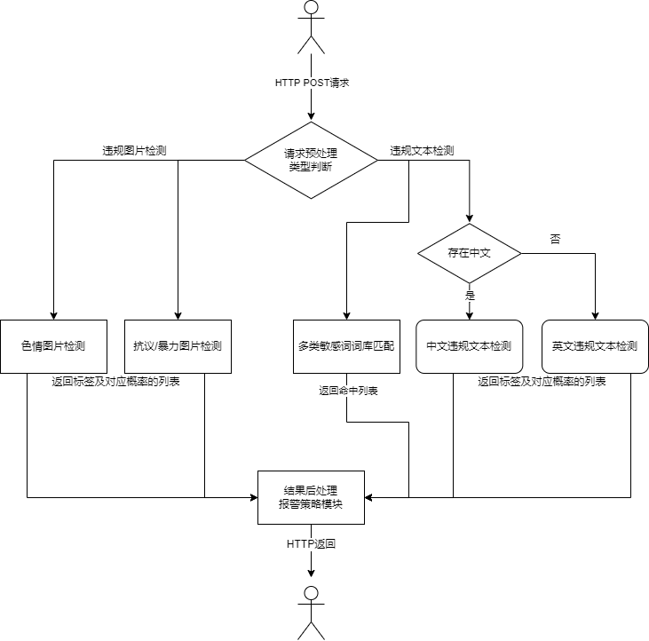

这个库主要完成前端的简单过滤和发送到后端更加处理
需要有Adblock   NSQ 部署了后端的服务地址配置     自定义的敏感词过滤(读取配置文件)


服务端：
自定义的策略  
AI后端的地址设置
不支持动态的词库扩展

# 概述

随着互联网上的图片，文本，视频信息日益膨胀，考虑到目前很多网民还是未成年人，因此检测其中的违规内容格外重要。本项目提供了部分违规内容的检测功能：违规图片检测（色情，恐暴）和违规文本检测（中文，英文）。本项目不提供具体的数据和模型文件，不提供训练代码，仅提供基于TorchServe的推理后端。

讲特点应该从这个特点本身的意义出发，实现难度不是衡量特点是否重要的目的，实现难度也不是开发者吹嘘的资本，

## 特点

* docker部署
* 面向客户端和管理员端的接口
* 较准确的识别
* 消息队列和负载均衡技术


# 从零开始部署

* python环境准备：参照https://pytorch.org/serve/安装TorchServe，其余需要安装的包通过`pip install -r requirements.txt`安装，如果Pytorch安装的是GPU版本，可以使用下面的检测代码

```python
import torch
torch.cuda.is_available()
import tensorflow as tf
# tf.test.is_gpu_available()
tf.config.list_physical_devices('GPU')
conda remove cudatoolkit --force
```

* 启动TorchServe模型的推理后端，若启动失败可以删掉logs文件夹再次尝试，具体命令如下：

```shell
# 首先启动四个TorchServe模型的推理后端
torchserve --start --model-store model_store --models nsfw_model=nsfw_model.mar protest_model=protest_model.mar cn_text_model=cn_text_model.mar en_text_model=en_text_model.mar
torchserve --stop
```

```shell
# 然后测试一下TorchServe是否正常运行
curl http://127.0.0.1:8080/predictions/nsfw_model -T ./test/test_img/porn.jpg
curl http://127.0.0.1:8080/predictions/protest_model -T ./test/test_img/protest_sign.jpg
curl -X POST http://127.0.0.1:8080/predictions/cn_text_model -T ./test/cn_text_test.txt
curl -X POST http://127.0.0.1:8080/predictions/en_text_model -T ./test/en_text_test.txt
```

* 通过`go mod tidy && go build`构建GoDetector可执行文件，然后启动Golang的后台WEB服务

* 访问 http://127.0.0.1:8000/index/test 快捷查看测试部署效果，注意这只是内部测试页面


* 补充Docker的启动流程

# 功能实现

## 违规图片检测：

### 色情图片检测：

* 分类标签：

```
- porn：pornography images
- hentai：hentai images and pornographic drawings
- sexy：sexually explicit images, but not pornography
- neutral：safe for work neutral images
- drawings：safe for work drawings and anime
```

* 参考资料：

\- 数据来源：https://github.com/alex000kim/nsfw_data_scraper

\- Tensorflow2模型：https://github.com/GantMan/nsfw_model 

\- Pytorch模型：https://github.com/yangbisheng2009/nsfw-resnet.git

\- Yahoo开源模型：https://github.com/yahoo/open_nsfw

* 开发体会：

```
- 其他来源的数据集质量没有nsfw_data_scraper高，主要体现在sexy和pron的图片分不清楚。
- 对于正常标签的图片可以用ImageNet的数据集扩充。
- 追求使用EfficientV2这种新的模型或者数据增强的方法会浪费很多时间，效果也没多大提升。
- 保底的策略是把Yahoo的开源caffe模型转换成Pytorch模型，免去训练的耗时。
```

* TorchServe运行方式：

```shell
torchserve --start --model-store model_store --models nsfw_model=nsfw_model.mar
# 关闭方式
# torchserve --stop 
```

* Curl测试接口：

test/test_img 文件夹下面包含提供的测试图片，文件名为真实标签

```
curl http://127.0.0.1:8080/predictions/nsfw_model -T ./test/test_img/porn.jpg
```

运行结果：

```
{
  "porn": 0.6816046833992004,
  "sexy": 0.2803221046924591,
  "neutral": 0.03365671634674072,
  "hentai": 0.0038238749839365482,
  "drawings": 0.0005926391459070146
}
```

测试结论：

```
- 色情图片能够准确识别出来
- 类似比基尼的性感图片不会误判成色情图片
- 类似大卫雕像的图片不会误判成色情图片
```

### 抗议/暴力图片检测

* 分类标签

```
- protest：contains a binary value: 1 (protest) or 0 (not protest)
- violence：contains a real number in range between 0 (least violent) and 1 (most violent) 
- Other visual attributes are all binary: 1 (with the attribute), 0 (without the attribute)。Specifically, this includes: "sign", "photo", "fire", "police", "children", "group_20", "group_100", "flag", "night", "shouting".
- Please note that only protest images (images for which <protest> = 1) have violence and visual attribute annotations.
```

- 参考资料：

\- 论文：[Protest Activity Detection and Perceived Violence Estimation from Social Media Images](https://arxiv.org/abs/1709.06204)

\- 代码：https://github.com/wondonghyeon/protest-detection-violence-estimation.git

\- 数据：通过邮件的方式请求论文作者提供

- 开发体会：

```
- 调研阶段没有找到相关的公开数据集，于是这个任务直接用的Donghyeon Won等人的成果，万分感谢。
- 类似上面这种基于图片分类的恐暴检测方案粒度有点大，部分场景下检测效果不佳，有精力尝试基于目标检测技术实现
```

* TorchServe运行方式：

```
torchserve --start --model-store model_store --models protest_model=protest_model.mar
# 关闭方式
# torchserve --stop 
```

* Curl测试接口：

```
curl http://127.0.0.1:8080/predictions/protest_model -T ./test/test_img/protest_sign.jpg
```

运行结果：

```
{
  "sign": 0.17170631885528564,
  "protest": 0.17033971846103668,
  "children": 0.07608138769865036,
  "violence": 0.07127571851015091,
  "group_20": 0.06621399521827698
}
```

测试结论：

```
- protest_sign.jpg中的标语抗议被准确识别了出来
- protest_fire.png中的纵火抗议被准确识别了出来
```

## 违规文本检测

### 敏感词过滤

* 目标概述：

```
- 敏感词过滤指的是检测文本中存在的敏感词，比如色情类，谩骂类，政治类的敏感词，本节将会返回查询文本命中的敏感词列表
- 该部分对于个人开发者而言最重要的是敏感词库的构建，其次才是模型，我将会搜集整理网上的各种敏感词库，但是最终版不便开源出来
- 文本匹配的模型可以选择Trie树，AC自动机等，我将会测试这些算法的性能，并且提出自己的创新点，最终开发一个文本过滤的框架
```

* 敏感词库构建：

```
- 尽力搜集网上的敏感词库并整理，最终的敏感词库单独分类：广告（120条），政治（1037条），暴恐（614条），民生（515条），网址（14595条），色情（560条），其他(14331条)。
- 敏感词库构建时采取的处理手段包括：不同来源的词库合并去重，敏感词繁简体转换，敏感词拆字（如‘奶’拆成‘女’和‘乃’），拼音替代（如‘操’转成‘wo cao’)。代码见sensitive-filter文件夹。
- 特别注意的是，本词库搜集了部分违规网站的网址和部分恶意的DNS，详细来源自项目https://github.com/stamparm/maltrail/，该项目在初次启动的时候会从各大安全网站下载目前最新的恶意网址和DNS信息，我们只需要在这里加上自己的导出逻辑即可。
```

* 文本匹配算法：

  * 对于普通匹配算法，如果遍历查找时间复杂度是O(n^2)，用二分查找法时间复杂度是O(logn)，如果用TreeMap去匹配，时间复杂度是O(logn)，这里的n指的是词典的大小，如果用HashMap的话，时间复杂度是O(1)，但是空间复杂度又上去了，所以，想要找到一种速度又快，同时内存又省的数据结构，来完成这个匹配操作。本框架将会实现的三种算法：KMP，Trie树，AC自动机
  * 问题定义：给一个很长很长的母串 长度为n，然后给m个小的模式串，求这m个模式串里边有多少个是母串的字串。如果用KMP让每一模式串与母串进行匹配，这样时间复杂度为O((n + len(m))*m)，其实对这m个模式串建立一个DFA的话还可以更快。DFA的特征：有一个有限状态集合和一些从一个状态通向另一个状态的边，每条边上标记有一个符号，其中一个状态是初态，某些状态是终态。但不同于不确定的有限自动机，DFA中不会有从同一状态出发的两条边标志有相同的符号。
  * 我们通过构造这m个模式串的前缀树，其实就是构造了一种DFA，如果要求一个母串包含哪些模式串，以用母串作为DFA的输入，在DFA 上行走，走到终止节点，就意味着匹配了相应的模式串。其实，如果我们基于Trie树构造Trie图的话又能进一步提高速度。
  * AC自动机是Trie图的一种构造方式，它是解决字符串多模匹配问题的利器，借鉴KMP中避免母串在匹配过程种指针回溯的方法的思想（通过next数组避免指针做不必要的前移），在Trie图中定义了前缀指针的概念，从根节点沿边到节点p我们可以得到一个字符串S，节点p的前缀指针定义为：指向树中出现过的S的最长的后缀。

  

  * 构造前缀指针的步骤为：根据深度一一求出每一个节点的前缀指针。对于当前节点，设他的父节点与他的边上的字符为Ch，如果他的父节点的前缀指针所指向的节点的儿子中，有通过Ch字符指向的儿子，那么当前节点的前缀指针指向该儿子节点，否则通过当前节点的父节点的前缀指针所指向点的前缀指针，继续向上查找，直到到达根节点为止。再考虑一下它的时间复杂度，设m个模式串的总长度为LEN，所以算法总的时间复杂度为O(LEN + n)。

* 文本过滤框架sensitive-filter：

  - 预处理阶段需要应对常见的反过滤手段，比如无关字符干扰，拼音替代等，由于之前构建敏感词库的过程中已经做了部分数据增强，所以此时输入字符串检测时只需要采取去除无关字符/停用词的方法

  - 对于输入文本中的敏感词，本框架支持查找、验证、过滤和替换等策略，另外支持返回文本包含的敏感词的类别和敏感程度的列表（只需要对上面的每一类敏感词库分别构建Trie树，然后原输入字符串依次匹配即可，本框架作为底层功能暂未实现）。

  - 下面是本框架的基本使用方式：

```go
func TestExample(t *testing.T) {
	filter := NewFilter()
	err := filter.LoadWordDict("./敏感词库/其他.txt")
	if err != nil {
		t.Errorf("LoadWordDict Failed: %v", err)
	}
	filter.AddWord("长者")
	t.Log(filter.Filter("我为长者续一秒"))       // 我为续一秒
	t.Log(filter.Replace("我为长者续一秒", '*')) // 我为**续一秒
	t.Log(filter.FindIn("我为长者续一秒"))       // true, 长者
	t.Log(filter.Validate("我为长者续一秒"))     // False, 长者
	t.Log(filter.FindAll("我为长者续一秒"))      // [长者]
	//测试过滤功能的抗噪效果，默认不开启抗噪效果
	t.Log(filter.FindIn("我为长@者续一秒")) // false
	filter.UpdateNoisePattern(`[\|\s&%$@*]+`)
	t.Log(filter.FindIn("我为长@者续一秒"))   // true, 长者
	t.Log(filter.Validate("我为长@者续一秒")) // False, 长者
}
```

### 中文违规文本检测

关于为什么要将中文和英文的违规文本检测分开实现，主要是因为二者的分词，预训练模型，数据集等方面确实存在很大的差异，实在没有办法用一个模型实现，遂分开

* 参考资料：

\- 数据集来源：翻译自Kaggle提供的类似的英文数据集（[Toxic Comment Classification Challenge | Kaggle](https://www.kaggle.com/c/jigsaw-toxic-comment-classification-challenge)），使用各大云商的翻译API接口翻译了1.5万条左右（主要是因为没钱）

\- 代码参考：预训练语言模型最经典的库https://github.com/huggingface/transformers.git，主要代码修改自Kaggle的有害评论分类任务https://github.com/unitaryai/detoxify.git

* TorchServe运行方式：

```shell
torchserve --start --model-store model_store --models cn_text_model=cn_text_model.mar
# 关闭方式
# torchserve --stop 
```

* Curl测试接口：

./test/cn_text_test.txt包含提供的测试文本，含有违规文本

```
curl -X POST http://127.0.0.1:8080/predictions/cn_text_model -T ./test/cn_text_test.txt
```

运行结果：

```
0.9769131
```

该值对应的是违规文本的概率，一般而言大于0.7即可认为是有害文本

* Bug解决记录：

该开始的时候我非常困惑curl发送到后台的文本都是乱码，最终找到问题原因：不是因为curl请求时没有将数据正确编码，只是因为python的logging框架控制台打印只支持ASCII编码，定位这个问题确实花费了我不少精力，解决方案就是添加编码格式为utf-8的FileHandler，查看log文件发现后台正常接受了中文文本。

```python
# 解决了logging打印中文乱码的问题
import logging
root_logger= logging.getLogger()
root_logger.setLevel(logging.DEBUG) # or whatever
handler = logging.FileHandler('d:/test.log', 'w', 'utf-8') # or whatever
formatter = logging.Formatter('%(name)s %(message)s') # or whatever
handler.setFormatter(formatter) # Pass handler as a parameter, not assign
root_logger.addHandler(handler)
root_logger.info(sentences)
```

### 英文违规文本检测

* 分类标签：

```
- toxicity: 有害的
- severe_toxicity: 极度有害的
- obscene：淫秽的
- threat：威胁语气
- insult：侮辱语气
- identity_attack：身份歧视（性别，种族等）
```

* 参考资料：

\- 数据集来源：Kaggle的有害评论分类任务提供的英文数据集（[Toxic Comment Classification Challenge | Kaggle](https://www.kaggle.com/c/jigsaw-toxic-comment-classification-challenge)、[Jigsaw Unintended Bias in Toxicity Classification](https://www.kaggle.com/c/jigsaw-unintended-bias-in-toxicity-classification)、[Jigsaw Multilingual Toxic Comment Classification](https://www.kaggle.com/c/jigsaw-multilingual-toxic-comment-classification)）

\- 代码参考：预训练语言模型最经典的库https://github.com/huggingface/transformers.git，主要代码修改自Kaggle的有害评论分类任务https://github.com/unitaryai/detoxify.git

* TorchServe运行方式：

第一次启动时会联网下载一些 huggingface transformers 的配置文件，请确保网络畅通

```shell
torchserve --start --model-store model_store --models en_text_model=en_text_model.mar
# 关闭方式
# torchserve --stop 
```

* Curl测试接口：

./test/en_text_test.txt包含提供的测试文本，含有违规文本，其真实标签是toxicity和obscene

```
curl -X POST http://127.0.0.1:8080/predictions/en_text_model -T ./test/en_text_test.txt
```

运行结果：

```
{'toxicity': 0.990424, 'severe_toxicity': 0.07567663, 'obscene': 0.9390912, 'threat': 0.0045800083, 'insult': 0.84097433, 'identity_attack': 0.00858633}
```

该值对应的是违规文本所属每一类的概率，虽然误分类了insult标签，但是无伤大雅，可见模型效果很好。

# GoDetector系统设计

```

```


## 阻止策略设计

* 针对图片检测（阈值0.12可调）

```
- 在色情图片检测中概率最大的标签是porn或者hentai时，判定为色情违规图片
- 在抗议/暴力图片检测中，由于此任务的标签有12个之多，所以每一个标签的softmax概率值不会很大，此处如果protest标签的概率值超过0.12且有另一个标签的概率值超过0.12则可以判定抗议/暴力图片违规
- 上面两个子任务任意有一个出现违规则最终给出阻止当前内容的建议
```

* 针对文本过滤（权重weight可调）（参考一下TF-IDF你还要考虑文本长短）

```
- 在敏感词匹配中，有广告，政治，暴恐，民生，网址，色情，其他共7类敏感词，考虑到敏感词库的质量原因，不便于出现敏感词就阻止，设第i类敏感词库中匹配到的敏感词数量为num(i)，第i类的重要性记作weight(i)，i属于0-6，此处给出加权的敏感词数量S的计算公式，如果该值大于等于2则判断为违规文本
```

$S=\sum_{i=0}^6weight(i)*num(i)$ 其中 $\sum_{i=0}^6weight(i)=7$

* 针对文本检测（阈值0.7可调）

```
- 如果用户请求文本中含有中文则进行中文违规文本检测，返回的值大于0.7则有相当的把握认为是有害文本
- 如果用户请求文本中含有英文则进行英文违规文本检测，返回结果中toxicity、severe_toxicity、obscene、threat、insult、identity_attack这6个标签任意有一个概率值大于0.7则有相当的把握认为是有害文本
- 如果敏感词匹配任务或者NLP违规文本检测任务判断输入文本违规，那么最终给出阻止当前内容的建议
```

## API设计

* 对内测试API设计

（请求方法判断）

```
GET /index/test：访问测试主页面
GET /model/health: 查询TorchServe后端各模型状态
POST /model/setting：设置阻止策略的相关参数
POST /image/nsfw: 色情图片检测
POST /image/protest: 抗议/暴力图片检测
POST /text/filter: 文本敏感词过滤
POST /text/cnt: 中文违规文本检测
POST /text/en: 英文违规文本检测
```

* 正式系统API设计

```
GET /index：访问系统主界面，有必要美化
POST /detect/image: 图片违规检测，按照一定策略综合色情和暴恐检测结果
POST /detect/text：文本违规检测，按照一定策略综合敏感词库匹配和中文英文违规文本的检测结果
POST /detect/images: 批量图片违规检测
POST /detect/texts：批量文本违规检测
```

## 主流程图



```
首先判断POST请求体类型，图片和文本的违规检测需要分别进行，具体的检测步骤大致包括数据的预处理，调用TorchServe的推理接口，数据的后处理三大步骤，最终的结果将会经过报警策略模块，从而给出针对当前输入的过滤建议（阻止还是放行）和检测报告。
```

## 设计细节

* 如何处理接口被大量调用的情形？

```
调研实现缓冲队列，nsq或者go-cache
请求置表，前台打包，返回结果再分解返回
同样的图片保存Hash值，下一次缓存的时候直接返回，时间限制
```

* 当TorchServe系统出错后如何处理？

```
报警+自动重启保护进程
```

* 阻止策略的自动完善自适应的策略？

```
首先敏感词在运行中需要可以修改
根据输入语句的长度决定后台的调用策略。因为双前数组的构建时间更加短
策略可定义语言（适用场景，不停机更新系统，优于以前的写死到代码中，配置文件，远程配置，）
```

* 阙建明师兄的插件机制可以学习

```
锚点到底是怎么埋得
```

## 各个子模块的压测数据，

## 需要做一下HTML界面


TODO

```
非GPU和GPU自动适配
可以支持Docker部署
接入负载均衡，NSQ技术
把后端的过滤规则和采集模块进行划分
采集模块包含简单的过滤规则
```

产出

```
我们只提供接口，不提供GUI的客户端和管理员端
Logstash的Go语言版本，通过yaml定义数据处理流程，插件可定义的处理流程，引入依赖足够轻
利用这个框架实现毕业设计而不是强耦合
前端采集需要有简单的过滤，并且具备发送数据的能力
用户侧只管发送数据调用接口，本地SDK，我们本地实际上根本不存在什么客户端，Adblock（流量拦截），规则
服务端，管理员端需要监控系统状态
消息队列技术和缓存技术并不会提高系统的吞吐量
提高吞吐量的方式只有两种，优化代码以提高处理效率，扩展机器
注意输入字符长度不超过150，self.max_seq_len = 150，否则将会截断 所以需要批量预测
```

